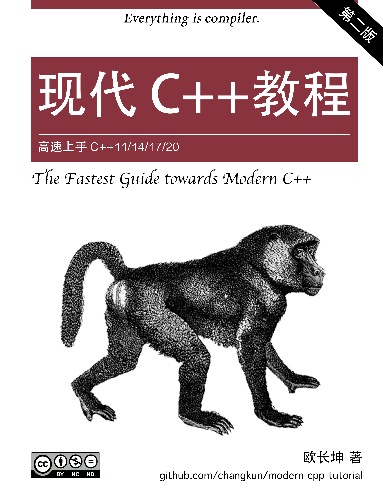

# 《高速上手 C++11/14/17》

> 本教程正在向全面介绍 C++17 特性的内容过度，尽请期待。

## 本书目的

本教程号称高速上手教程，从内容上对二十一世纪二十年代之前产生 C++ 的相关特性做了非常相对全面的介绍，读者可以自行根据下面的目录选取感兴趣的内容进行学习，快速熟悉需要了解的内容。这些特性并不需要全部掌握，只需针对自己的使用需求和特定的应用场景，学习、查阅最适合自己的新特性即可。

同时，本教程在介绍这些特性的过程中，尽可能简单明了的介绍了这些特性产生的历史背景和技术需求，这为理解这些特性、运用这些特性提供了很大的帮助。

此外，本教程希望读者在阅读本书后，能够努力在新项目中直接使用 C++17，并努力将旧项目逐步迁移到 C++17。也算是笔者为推进现代 C++ 的普及贡献了一些绵薄之力。

## 目标读者

1. 本教程假定读者已经熟悉了传统 C++ ，至少在阅读传统 C++ 代码上不具备任何困难。换句话说，那些已经学习过或者长期使用传统 C++进行编码的人、渴望在短时间内迅速了解**现代 C++** 特性的人非常适合阅读本书；
2. 本教程一定程度上介绍了一些现代 C++ 的**黑魔法**，但这些魔法毕竟有限，不适合希望进阶学习现代 C++ 的读者，本教程的定位系**现代 C++ 的快速上手**。当然，希望进阶学习的读者可以使用本书来回顾并检验自己对 **现代 C++** 的熟悉度。

## 目录

从[这里](book/toc.md)开始阅读。

## 交流

1. 笔者时间和水平有限，如果读者发现教程中内容的错误，欢迎提 [issue](https://github.com/changkun/cpp1x-tutorial/issues)；
3. 本教程有以下交流群，有兴趣的读者可以加入，加群请注明 `github`：

## 致谢

笔者感谢以下读者指出本书中出现的错误：

[Recolic Keghart](https://www.gitbook.com/@recolic), [sinomiko](https://www.gitbook.com/@sinomiko), [Wang Zhenhua](https://www.gitbook.com/@jackwish), [asm warrior](https://www.gitbook.com/@asmwarrior), [garicc](https://www.gitbook.com/@ihpy), [Wenhan Jiang](https://www.gitbook.com/@jiangwenhan), [liang xiao](https://www.gitbook.com/@liangx8)

## 赞助

如果你认为本教程对你起到了帮助并希望赞助作者，可以通过下面的二维码给予支持。

|微信|支付宝|
|:--:|:--:|
| | |

## 许可

本教程由[欧长坤](https://github.com/changkun)撰写，采用[知识共享署名-非商业性使用-禁止演绎 4.0 国际许可协议](http://creativecommons.org/licenses/by-nc-nd/4.0/)许可。项目中代码使用 MIT 协议开源，参见[许可](./LICENSE)。
